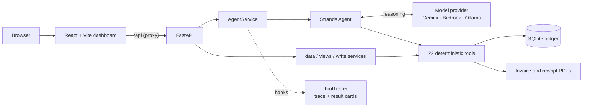

# FreelanceFlow

**An AI billing operations agent for freelancers, built on the [Strands Agents SDK](https://strandsagents.com).**

[](LICENSE)


You tell it what happened, in your own words:

> **"Rahul paid me ₹15,000 today."**

FreelanceFlow finds Rahul, works out which invoice the money belongs to, parses
the amount, records the payment, recalculates the balance and issues a receipt,
and shows you every step it took. Each of those steps is a deterministic Python
tool writing to a real ledger. The model decides *what* to do. It never invents
a client, an invoice number or a rupee.

---

## Table of contents

- [The problem](#the-problem)
- [What makes it an agent, not a chatbot](#what-makes-it-an-agent-not-a-chatbot)
- [Features](#features)
- [Try it: a two-minute walkthrough](#try-it-a-two-minute-walkthrough)
- [Architecture](#architecture)
- [Tech stack](#tech-stack)
- [Getting started](#getting-started)
- [Configuration](#configuration)
- [Model providers](#model-providers)
- [The agent's 22 tools](#the-agents-22-tools)
- [API reference](#api-reference)
- [Project structure](#project-structure)
- [Testing](#testing)
- [Design decisions](#design-decisions)
- [Security](#security)
- [Deployment](#deployment)
- [Status, limitations and roadmap](#status-limitations-and-roadmap)
- [License](#license)

---

## The problem

Independent freelancers do their own accounts receivable: they raise invoices,
chase late payments, match incoming transfers to the right invoice and keep
receipts, usually across a spreadsheet, a notes app and a banking app. The work
is small but constant, and the mistakes are costly: a payment recorded against
the wrong invoice, a reminder sent for money already received, a balance that
no longer matches the paperwork.

Chat assistants can talk about this work but can't be trusted to do it, because
a language model will happily produce a plausible balance it never looked up.
FreelanceFlow is built around that failure mode.

## What makes it an agent, not a chatbot

**The model orchestrates. Python does the money.** Every action the agent takes
is a call to one of 22 typed tools. The tools read and write SQLite, do all the
arithmetic in integer minor units (paise), assign invoice numbers inside a
database transaction and render PDFs from the ledger. The model chooses which
tools to call and in what order; it never computes a figure itself.

**Every step is visible.** Each chat response carries the tool calls the agent
actually made: tool name, arguments, the tool's own status and timing. The
dashboard renders that trace under each reply, so you can see that
`find_client → list_invoices → parse_amount → record_payment` really ran.

**Results come from tool output, not prose.** When a turn records a payment or
creates an invoice, the result card under the reply is built from the tool's
return value. The amount, invoice number and remaining balance on the card are
the ledger's figures, even if the model's sentence paraphrases them.

**It refuses rather than guesses.** Tools return explicit statuses: `found`,
`not_found`, `ambiguous`, `duplicate_suspected`, `error`. Two clients named
Rahul means the agent asks which one. A payment larger than the balance is
refused with the real outstanding figure. "Mark it paid" with no amount means
the agent asks how much. The system prompt forbids reporting any action as done
unless a tool returned success.

**The dashboard works without the model.** Every screen reads and writes
through the same tools the agent uses, so the app is fully operable by hand. The
agent adds speed; it isn't a single point of failure.

## Features

### The agent

| You say | The agent does |
|---|---|
| "Rahul paid me ₹15,000 today" | Finds the client and the open invoice, records the payment, recalculates the status, offers a receipt |
| "Who owes me money?" | Lists outstanding and overdue invoices with per-currency totals |
| "Create an invoice for Meera for 85k for the brand redesign" | Parses "85k" into ₹85,000.00, allocates the next invoice number, creates the invoice |
| "Draft a reminder for Priya" | Writes a reminder built from the invoice's own figures, left as a draft for your approval |
| "How much did I receive this month?" | Returns received, outstanding and overdue for the period |

Amounts can be written the way people say them: `40k`, `1.5 lakh`, `Rs 40,000/-`, `₹15,000`.

### The dashboard

Ten screens, grouped by the work:

- **Overview**: outstanding and overdue totals, this month's collection rate, the invoices that need attention, and recent ledger activity
- **Agent**: conversation with the live tool trace and result cards
- **Invoices** and **invoice detail**: status, amount, paid, outstanding, due date, payment history and PDF download
- **Clients** and **client detail**: per-client balances, invoice and payment history, inline editing
- **Payments**: the ledger, filterable by date range and client, with the total for exactly that filter, plus receipt PDFs
- **Overdue**: collections view, most overdue first, with one-click reminder drafting and payment recording
- **Reminders**: draft → approve → copy, or cancel; nothing is ever sent automatically
- **Reports**: invoiced against received by month, breakdown by client, status distribution, with Indian financial-year presets

### Documents

- Invoice PDFs and receipt PDFs rendered deterministically from the ledger
- Indian digit grouping (₹1,50,000.00) with an embedded font that carries the ₹ sign
- A receipt records the balance as it stood when that payment arrived, and a payment keeps one receipt number for life

## Try it: a two-minute walkthrough

With the app running on the demo ledger (see [Getting started](#getting-started)):

1. **Overview**: note that Rahul Sharma's invoice **FF-0005** for **₹40,000** is unpaid. The demo seed leaves it that way on purpose.
2. **Agent**: type **"How much does Rahul owe me?"**. Watch the trace: `find_client → get_client_balance`.
3. Type **"Rahul paid me ₹15,000 today"**. The trace shows the payment being recorded, and the result card shows **₹25,000.00** remaining.
4. **Invoices → FF-0005**: the payment is in the history, the status is *Partially paid*, and the receipt PDF is one click away.
5. Type **"Record ₹99,000 against FF-0005"**. The agent refuses and quotes the real outstanding balance.

## Architecture



- **The browser never talks to Strands.** The frontend calls FastAPI, which calls
  `AgentService`, the only component that constructs an agent or invokes a
  model. Route handlers don't import Strands.
- **The dashboard and the agent share one set of tools.** A client created by
  hand and a client created by the agent go through the same validation, so
  there's no second, weaker path into the database.
- **Every figure on screen is computed on the server** in
  `app/services/views.py`, from the same helpers the reporting tools use. The
  frontend renders the `*_display` strings it's sent and does no money
  arithmetic.
- **Tracing is a Strands hook.** `ToolTracer` registers `BeforeToolCallEvent`
  and `AfterToolCallEvent` callbacks and records each call's name, arguments,
  result and duration.

## Tech stack

| Layer | Technology |
|---|---|
| Agent framework | [Strands Agents SDK](https://strandsagents.com) 1.54 |
| Models | Google Gemini (`gemini-3.5-flash-lite`) · Amazon Bedrock (Amazon Nova) · Ollama |
| Backend | Python 3.10+, FastAPI, Uvicorn |
| Storage | SQLite, money as integer minor units |
| Documents | ReportLab |
| Frontend | React 19, TypeScript 5.8, Vite 6, Tailwind CSS 4 |
| Deployment target | Amazon Bedrock AgentCore Runtime (ARM64 container) |
| Tests | pytest, a scripted Strands model for offline agent-loop tests |

## Getting started

### Prerequisites

- **Python 3.10+** (developed on 3.13)
- **Node.js 20+** (for the dashboard)
- **A model provider.** The quickest option is a free Google Gemini API key from
  [aistudio.google.com/apikey](https://aistudio.google.com/apikey). See
  [Model providers](#model-providers) for Bedrock and Ollama.

### 1. Install the backend

```bash
git clone <your-repo-url> freelanceflow
cd freelanceflow

python -m venv .venv
# Windows:      .venv\Scripts\activate
# macOS/Linux:  source .venv/bin/activate

pip install -r requirements.txt
cp .env.example .env
```

### 2. Add your model key

Open `.env` and set:

```ini
FF_MODEL_PROVIDER=gemini
GEMINI_API_KEY=your-key-here
```

`.env` is gitignored. Never commit a key.

### 3. Seed a demo ledger

```bash
python -m app.seed --data-dir data/demo
```

This creates 6 clients, 10 invoices and a realistic payment history, dated
relative to today so the demo never goes stale. It writes to its own database
and refuses to write into one that already has clients.

### 4. Run the API

```bash
# macOS/Linux
FF_DATA_DIR=data/demo uvicorn app.api.main:app --reload --port 8000

# Windows PowerShell
$env:FF_DATA_DIR="data/demo"; uvicorn app.api.main:app --reload --port 8000
```

Interactive API docs: http://localhost:8000/docs

### 5. Run the dashboard

```bash
cd frontend
npm install
npm run dev
```

Open **http://localhost:5173**. Vite forwards `/api` to the API, so the browser
only ever talks to its own origin.

### Command line

The agent also runs in a terminal:

```bash
python -m app.cli                                  # interactive session
python -m app.cli "Add a client called Rahul Sharma"
```

## Configuration

All settings are environment variables, usually set in `.env`.

| Variable | Default | Purpose |
|---|---|---|
| `FF_MODEL_PROVIDER` | `auto` | `gemini`, `bedrock`, `ollama` or `auto` |
| `FF_MODEL_ID` | per provider | Override the model, e.g. `gemini-3.5-flash-lite` |
| `GEMINI_API_KEY` | none | Google Gemini API key |
| `FF_AWS_REGION` | none | Bedrock region. Deliberately has no default |
| `OLLAMA_HOST` | `http://localhost:11434` | Ollama endpoint |
| `FF_DATA_DIR` | `data` | Where the database and PDFs live |
| `FF_CURRENCY` | `INR` | Default currency for new invoices |
| `FF_BUSINESS_NAME`, `FF_BUSINESS_EMAIL`, `FF_BUSINESS_PHONE`, `FF_BUSINESS_ADDRESS` | placeholders | Printed on invoices and receipts |
| `FF_INVOICE_PREFIX` / `FF_RECEIPT_PREFIX` | `FF` / `RC` | Document number prefixes |
| `FF_CORS_ORIGINS` | localhost dev origins | Comma-separated allowed origins. `*` is refused |
| `FF_GEMINI_THINKING` | `low` | Gemini thinking level: `minimal`, `low`, `medium`, `high`, or `off` |
| `FF_SEED_DEMO` | off | `true` seeds the demo ledger at startup when the database is empty |
| `FF_STATIC_DIR` | `frontend/dist` | Built dashboard the API serves, if present |

## Model providers

The agent is a Strands agent whatever the model. Nothing outside
`app/model_provider.py` knows which provider is in use.

| Provider | Model | Needs |
|---|---|---|
| **Google Gemini** | `gemini-3.5-flash-lite` via Strands' `GeminiModel` | `GEMINI_API_KEY` (free tier available) |
| **Amazon Bedrock** | Amazon Nova, `apac.amazon.nova-pro-v1:0` | AWS credentials, `FF_AWS_REGION`, Nova enabled under Bedrock → Model access |
| **Ollama** | `llama3.1` | Ollama running locally |

With `FF_MODEL_PROVIDER=auto`, FreelanceFlow uses Gemini if a key is set, then
Bedrock if AWS credentials resolve, then Ollama if it's running. The Anthropic
and OpenAI APIs are not supported providers, and a test asserts that nothing
reads an `ANTHROPIC_API_KEY`.

> **Free-tier privacy note:** on Gemini's free tier, Google may use prompts to
> improve its models. Use the demo ledger rather than real client records.

**Free preflight check.** Before any live run, verify the setup without calling a model:

```bash
python -m app.live_check --preflight --provider gemini
```

## The agent's 22 tools

| Area | Tools |
|---|---|
| **Amounts** | `parse_amount`: "40k", "1.5 lakh", "Rs 40,000/-" → minor units |
| **Clients** | `find_client` · `create_client` · `list_clients` · `update_client` |
| **Invoices** | `create_invoice` · `get_invoice` · `list_invoices` · `get_next_invoice_number` |
| **Payments** | `record_payment` · `get_payment` · `list_payments` |
| **Reports** | `get_overdue_invoices` · `get_outstanding_invoices` · `get_client_balance` · `get_financial_summary` |
| **Reminders** | `create_payment_reminder` · `approve_reminder` · `cancel_reminder` · `list_reminders` |
| **Documents** | `generate_invoice_pdf` · `generate_receipt` |

A test (`tests/test_agent_wiring.py`) walks `app/tools` and fails if any tool
exists but isn't registered with the agent.

## API reference

Every failure has one shape: `{"error": "<code>", "detail": "<human-readable>"}`.
A refused write (duplicate, overpayment, nothing outstanding) is a **409** that
carries the tool's own explanation. Full interactive docs are at `/docs`.

| Method | Path | Purpose |
|---|---|---|
| `GET` | `/api/health` | Liveness |
| `GET` | `/api/agent/status` | Which model provider is available, and why not |
| `POST` | `/api/chat` | One agent turn: reply, tool calls, result card |
| `DELETE` | `/api/chat/{session_id}` | Forget a conversation |
| `POST` | `/api/amounts/parse` | Parse "40k" into minor units |
| `GET` / `POST` | `/api/clients` | List / create clients |
| `GET` / `PATCH` | `/api/clients/{id}` | Client with balance and history / edit a field |
| `GET` / `POST` | `/api/invoices` | List / create invoices |
| `GET` | `/api/invoices/{id}` | Invoice with its payments |
| `GET` | `/api/invoices/{id}/pdf` | Invoice PDF |
| `GET` / `POST` | `/api/payments` | Ledger (filter by client, invoice, date range) / record a payment |
| `GET` | `/api/payments/{id}` | One payment |
| `GET` | `/api/payments/{id}/receipt` | Receipt PDF |
| `GET` / `POST` | `/api/reminders` | List / draft reminders |
| `POST` | `/api/reminders/{id}/approve` | Approve a draft |
| `POST` | `/api/reminders/{id}/cancel` | Withdraw a reminder |
| `GET` | `/api/reports/overview` | Everything the Overview screen shows |
| `GET` | `/api/reports/summary` | Period summary |
| `GET` | `/api/reports/monthly` | Invoiced vs received per month, with chart scale |
| `GET` | `/api/reports/clients` | Per-client breakdown |
| `GET` | `/api/reports/overdue` | Overdue invoices, most overdue first |
| `GET` | `/api/reports/outstanding` | Every invoice with money owed |
| `GET` | `/api/workspaces` | The available ledgers and what each holds |

## Project structure

```
app/
  agent.py              the Strands Agent: 22 tools + system prompt
  model_provider.py     Gemini / Bedrock / Ollama selection
  tracing.py            ToolTracer: Strands hooks recording every tool call
  database.py           SQLite schema, connections, gapless counters
  workspaces.py         separate ledgers selected per request
  models.py             row → dict converters (what the model reads)
  money.py              minor-unit parsing and currency formatting
  dates.py              ISO dates and derived overdue calculation
  pdf_generator.py      deterministic invoice and receipt rendering
  seed.py               demo ledger, dated relative to today
  preflight.py          free pre-run checks, actionable failure messages
  live_check.py         manual live-model smoke test, prints the tool chain
  agentcore_app.py      Amazon Bedrock AgentCore Runtime entrypoint
  cli.py                terminal entry point
  tools/                amounts, clients, invoices, payments, reports, reminders
  services/
    agent_service.py    the only component that invokes Strands
    views.py            every derived figure a screen shows
    data_service.py     read access for the dashboard
    write_service.py    dashboard writes, through the agent's own tools
  api/
    main.py             app factory, CORS, one error shape
    middleware.py       per-request workspace selection
    routers/            chat, commands, records, reports, workspaces
frontend/
  src/lib/api.ts        the only module that knows a backend exists
  src/pages/            one screen per feature
  src/components/       UI primitives, modals, sidebar
deploy/
  Dockerfile            ARM64 AgentCore container
  iam/                  least-privilege IAM policies
docs/
  AGENTCORE.md          deployment guide and storage limitations
tests/                  590 offline tests + opt-in live-model tests
```

## Testing

```bash
pytest -q          # 590 tests. No credentials, no network, no spend.
```

The suite covers money parsing and formatting, invoice numbering, payment and
status transitions, overdue derivation, reminders, PDF contents (read back out
of the generated file), every API endpoint, security properties, workspace
isolation, and the agent loop itself.

**The agent loop is tested without a model.** `tests/scripted_model.py` is a
Strands model that replays a fixed script of tool calls and replies. It proves
the hooks, tool execution, tracing and result feedback work offline. The live
tests then measure only what needs a real model: whether it picks the right
tools.

**Live tests are opt-in** and assert on the recorded tool chain, not the prose:

```bash
python -m app.live_check --scenario balance --provider gemini   # one read
python -m app.live_check --scenario payment --provider gemini   # one write
pytest -m live                                                  # the full live set
```

Each live check uses a scratch database, so it never touches real records. The
default test suite strips `GEMINI_API_KEY` and any provider override from the
environment, so a key in `.env` can never turn an ordinary test into a live
model call.

## Design decisions

- **Money is stored as integer minor units**, never floats. Formatting is integer arithmetic throughout, so nothing rounds.
- **`amount_paid` is not a column.** It's `SUM(payments.amount_minor)` computed on every read, so the stated balance and the payment ledger can't disagree.
- **"Overdue" is derived, never stored.** It's computed from the due date and the outstanding balance at read time, so it can't go stale while the app sits idle.
- **The database assigns invoice numbers, not the model.** The number is reserved inside the same transaction as the insert, so a failed insert leaves no gap.
- **Invoice status follows the money.** It's recalculated inside the same transaction as every payment, so UNPAID → PARTIALLY_PAID → PAID can't drift from the ledger.
- **Payments can't overshoot.** A payment above the outstanding balance is refused with the real figure.
- **Duplicates are flagged, not silently written.** An identical invoice or payment returns `duplicate_suspected`, and the caller must confirm with `allow_duplicate=true`.
- **Client names are deduplicated** through a normalised key with a unique index, so "Rahul", "rahul " and "RAHUL" can't become three clients.
- **The model does no arithmetic.** `parse_amount` turns "1.5 lakh" into minor units in Python, and text with two numbers or none is refused, not guessed.
- **Money is never summed across currencies.** Totals are returned as one entry per currency.
- **A reminder is drafted from the invoice, not phrased by the model.** Every figure in the message comes from the ledger, and nothing is ever sent without human approval.
- **A receipt records a moment.** It shows the balance as it stood when that payment arrived, even if regenerated after later payments.

## Security

- **Server paths never cross the HTTP boundary.** File paths are replaced with `pdf_available` / `receipt_available`, and absolute paths in free text are redacted.
- **Documents are served only from directories the app owns.** Containment is re-checked at the point of use, after resolving symlinks and `..`.
- **A wildcard CORS origin is refused at start-up**, because the API sends credentialed requests.
- **All SQL is parameterised.**
- **Error messages are sanitised** before they reach a client. Unexpected exceptions return a generic message, and the traceback stays in the server log.
- **Agent sessions are bounded** by a TTL and a hard cap, and session ids are server-issued so a caller can't name another user's session.
- **Workspaces are isolated.** Each ledger is its own database and document folder, and an agent conversation never continues across workspaces.
- **API keys never leave the server.** They're read from the environment, never logged, and never returned by `/api/agent/status`.

## Deployment

### Hosted demo (Render, one URL)

The root `Dockerfile` builds the dashboard and runs FastAPI, which serves it
alongside `/api`, so the whole app lives at one address. `render.yaml`
describes the service.

1. Push the repository to GitHub.
2. In [Render](https://render.com): **New → Blueprint**, then select the repository.
3. When asked for `GEMINI_API_KEY`, paste a key from
   [aistudio.google.com/apikey](https://aistudio.google.com/apikey). It's
   stored as a secret in Render, never in the repository.
4. Deploy. Share the `https://<service>.onrender.com` URL.

**Visitors never enter a key.** The key lives only in the server's
environment; the browser never sees it.

What the container does on start:

- **Serves the dashboard and the API from one origin**, so there's no CORS configuration.
- **Seeds the demo ledger if the database is empty** (`FF_SEED_DEMO=true`). Free hosts wipe the disk on restart, so every restart comes back to the same starting point, with Rahul's ₹40,000 invoice unpaid and ready for the walkthrough.
- **Keeps Gemini's thinking low** (`FF_GEMINI_THINKING=low`). A multi-step turn takes about ten seconds instead of over a minute.

Notes for a public demo:

- Everyone using the URL shares your key's free-tier quota. When the limit is reached, the agent says so rather than failing silently.
- Render's free tier sleeps when idle, so the first visit after a quiet period can take close to a minute to wake.
- Data written by visitors is lost when the instance restarts. That's intentional for a demo and wrong for real use; see [Status](#status-limitations-and-roadmap).

Run the same container locally:

```bash
docker build -t freelanceflow .
docker run -p 8000:8000 -e GEMINI_API_KEY=your-key freelanceflow
# open http://localhost:8000
```

### Amazon Bedrock AgentCore Runtime

The agent is also packaged for **Amazon Bedrock AgentCore Runtime**.
`app/agentcore_app.py` implements the runtime contract (`0.0.0.0:8080`,
`POST /invocations`, `GET /ping`, ARM64) and calls the same `AgentService` the
API uses, so no tool code changes for deployment.

```bash
python -m app.agentcore_app    # run the runtime contract locally
```

`deploy/` holds the ARM64 Dockerfile and least-privilege IAM policies (no
`bedrock:*`, no `bedrock-agentcore:*`). **Read
[docs/AGENTCORE.md](docs/AGENTCORE.md) before deploying against real data.**
AgentCore sessions have ephemeral per-session storage, so SQLite there is
neither shared nor durable. The doc sets out the migration path (EFS-mounted
SQLite or Postgres).

## Status, limitations and roadmap

**Working today**

- The full deterministic business layer: 22 tools, 590 passing tests
- The dashboard, all ten screens wired to the live API with no mock data
- The agent running live on Google Gemini through Strands, verified end to end: a read question produced the correct tool chain (`find_client → get_client_balance`) and the correct balance
- Invoice and receipt PDFs
- Workspace isolation in the API
- One-URL deployment: a Dockerfile and Render blueprint that serve the dashboard and API together and seed the demo ledger on start

**Known limitations**

- **Agent replies take seconds, not milliseconds.** Measured on `gemini-3.5-flash-lite` with low thinking: recording a payment (six tool calls, five model calls) took about 14 seconds; refusing an overpayment took about 7.
- **The Gemini free tier is rate-limited per minute.** `gemini-3.6-flash` allowed only 5 requests a minute, which a single payment turn nearly exhausts; that is why the default is the lite model. Check your own limits at https://ai.dev/rate-limit.
- **The Bedrock path is implemented but not yet live-validated.** Bedrock model access hadn't been granted on the development account.
- **SQLite is single-node.** Fine for one freelancer, not for multi-tenant or AgentCore production (see [docs/AGENTCORE.md](docs/AGENTCORE.md)).
- **Reminders aren't sent.** There's no email or messaging integration; approved reminders are copied and sent by hand.
- **The `list_invoices` / `list_payments` tool totals** sum a single currency. The dashboard's figures are per-currency, but the agent's list tools assume one currency.

**In progress**

- **Workspace chooser in the dashboard**: open on "Existing dashboard" (demo data) or "New dashboard" (an empty ledger). The API side is built and tested; the opening screen and switcher are next.
- **Live agent activity**: streaming each tool call to the dashboard as it runs, not after the turn. The tracer already emits the events; the streaming endpoint and panel are next.
- **Before/after balance cards** and an **audit trail** of ledger changes.

**Later**

- Postgres storage for multi-user and AgentCore deployments
- Sending approved reminders by email or WhatsApp
- Bank-statement import and automatic payment matching

## License

FreelanceFlow is released under the [MIT License](LICENSE).
